# Exercícios

Aqui estão as imagens das janelas dos exercícios A até K:

## Exercício A
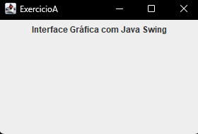

## Exercício B
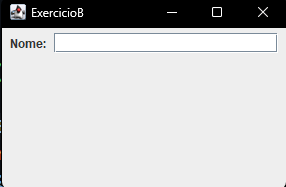

## Exercício C
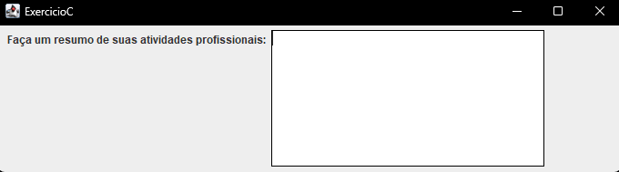

## Exercício D
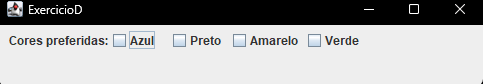

## Exercício E
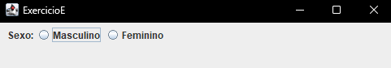

## Exercício F
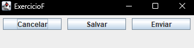

## Exercício G
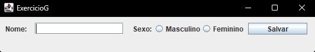

## Exercício H
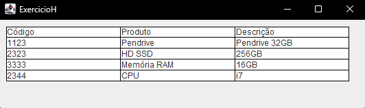

## Exercício I
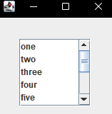

## Exercício J
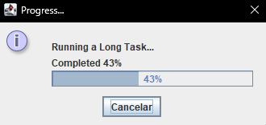

## Exercício K
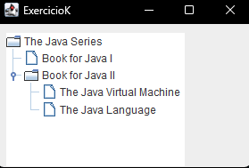
